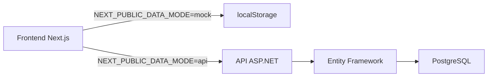

# Esotera — E-commerce de produtos esotéricos

Loja de tarôs e produtos esotéricos com frontend Next.js e backend ASP.NET Core.

**Dois modos de operação:**
- **Mock** (padrão): dados simulados no `localStorage`, ideal para desenvolvimento e deploy na Vercel
- **API**: integração completa com backend ASP.NET Core + PostgreSQL

## Arquitetura



## Tecnologias

### Frontend
- Next.js (App Router)
- TypeScript
- Tailwind CSS
- Zustand
- Lucide React

### Backend
- ASP.NET Core 9.0
- Entity Framework Core
- PostgreSQL
- JWT Authentication

## Instalação

### Frontend

```bash
npm install
```

### Backend (opcional, apenas para modo API)

```bash
cd backend
dotnet restore
```

Configure `backend/appsettings.local.json` com sua connection string PostgreSQL (veja `backend/README.md` para detalhes).

## Execução

### Modo Mock (padrão - localStorage)

```bash
npm run dev
```

Acesse [http://localhost:3000](http://localhost:3000).

Neste modo, todos os dados ficam no navegador. Ideal para desenvolvimento sem backend e para o deploy na Vercel.

### Modo API (com backend)

1. Inicie o backend:

```bash
cd backend
dotnet run --project Esotera.Api
```

Backend disponível em [http://localhost:5080](http://localhost:5080).

2. Configure o frontend:

Crie `.env.local`:
```bash
NEXT_PUBLIC_DATA_MODE=api
NEXT_PUBLIC_API_URL=http://localhost:5080
```

3. Inicie o frontend:

```bash
npm run dev
```

Acesse [http://localhost:3000](http://localhost:3000).

## Scripts

```bash
npm run lint
npm run build
npm run start
```

## Contas de demonstração

### Modo Mock

| Perfil | E-mail | Senha |
|--------|--------|-------|
| Cliente | `cliente@esotera.demo` | `demo123` |
| Admin | `admin@esotera.demo` | `demo123` |

Na tela de login há botões de acesso rápido para login demo (apenas no modo mock).

### Modo API

Veja `backend/README.md` para credenciais de seed do banco de dados.

## Cupom de teste

- Código: `DESCONTO5`
- Desconto: R$ 5,00 nos produtos
- Compra mínima: R$ 30,00
- 1 uso por cliente (controlado no `localStorage`)

## Onde alterar configurações

| Item | Arquivo |
|------|---------|
| Nome e dados da loja | `src/config/store.ts` (também editável em `/admin/configuracoes`) |
| Cores / tema | `src/config/theme.ts` e `src/app/globals.css` |
| Produtos | `src/data/products.ts` |
| Frete grátis, J3, subsídio | `src/config/shipping.ts` |
| Cupom | `src/config/coupon.ts` |
| Usuários demo | `src/config/demoUsers.ts` |

### Ativar subsídio de frete

Em `src/config/shipping.ts` (ou no painel admin):

```ts
shippingSubsidy: {
  enabled: true, // padrão: false
  amount: 10
}
```

## Estrutura principal

```text
src/
  app/                # Rotas (home, produtos, carrinho, checkout, conta, admin)
  components/         # UI, layout, home, cart, checkout, admin
  config/             # Loja, frete, cupom, tema, demos, dataMode
  data/               # Produtos e estados (seed para modo mock)
  hooks/
  services/
    api/              # API clients (authApi, productsApi, ordersApi, etc)
    repositories/     # Camada de abstração (IAuthRepository, etc)
                      # - Mock*Repository: usa localStorage
                      # - Api*Repository: usa API clients
    auth/             # mockAuthService (legacy)
    products/         # productRepository (legacy)
    coupon/           # mockCouponService (legacy)
    shipping/         # mockShippingService
    payment/          # mockPaymentService
  stores/             # Zustand + persist (usa repositories)
  types/
  utils/
public/images/products/  # Placeholders locais
backend/              # Backend ASP.NET Core (veja backend/README.md)
```

## Variáveis de ambiente

Copie `.env.example` para `.env.local` para configurar:

```bash
# Modo de dados: "mock" (padrão) ou "api"
NEXT_PUBLIC_DATA_MODE=mock

# URL da API (apenas para modo "api")
NEXT_PUBLIC_API_URL=http://localhost:5080

# Integrações futuras (Mercado Pago, Melhor Envio, J3)
NEXT_PUBLIC_MERCADO_PAGO_PUBLIC_KEY=
MERCADO_PAGO_ACCESS_TOKEN=
MELHOR_ENVIO_CLIENT_ID=
MELHOR_ENVIO_CLIENT_SECRET=
J3_API_URL=
J3_API_TOKEN=
```

**Importante:** O padrão `NEXT_PUBLIC_DATA_MODE=mock` garante que o deploy na Vercel funcione sem backend.

## Deploy

### Frontend na Vercel (modo API)

```bash
npx vercel --prod
```

Variáveis na Vercel (Production/Preview):

- `NEXT_PUBLIC_DATA_MODE=api`
- `NEXT_PUBLIC_API_URL=https://esotera-api.onrender.com`

URL pública: [https://esotera.vercel.app](https://esotera.vercel.app)

### Backend no Render

API pública: [https://esotera-api.onrender.com](https://esotera-api.onrender.com)

#### Bootstrap do primeiro administrador

Com a tabela `Users` vazia, crie o Admin real via variáveis de ambiente no Render (sem senha no código):

| Variável | Exemplo |
|----------|---------|
| `BOOTSTRAP_ADMIN_ENABLED` | `true` |
| `BOOTSTRAP_ADMIN_NAME` | Nome do admin |
| `BOOTSTRAP_ADMIN_EMAIL` | e-mail real |
| `BOOTSTRAP_ADMIN_PASSWORD` | senha forte (≥ 6) |

No próximo start da API, o bootstrap cria o usuário com `Role = Admin` e senha hasheada (BCrypt), se o e-mail ainda não existir. Depois:

1. Defina `BOOTSTRAP_ADMIN_ENABLED=false`
2. Remova `BOOTSTRAP_ADMIN_PASSWORD`
3. Faça login em `/login` com o e-mail/senha reais

Não use `SEED_DEV_DATA=true` em produção (isso cria apenas contas demo de desenvolvimento).

### Outros hosts (opcional)

O backend ASP.NET Core também pode ir para Azure App Service, Cloud Run ou VPS. Veja `backend/README.md`.

## Próximos passos

- Integrações de pagamento (Mercado Pago)
- Integrações de frete (Melhor Envio, J3)
- Exportação de pedidos (UpSeller)
- Otimização de imagens
- Testes E2E
- CI/CD

## Notas

- A loja na Shopee bloqueou o acesso automatizado. Imagens oficiais não foram baixadas.
- O produto principal (Tarô de Waite, R$ 39,90) usa dados confirmados publicamente.
- Demais itens usam nome/preço de referência e conteúdo marcado como demonstração.
