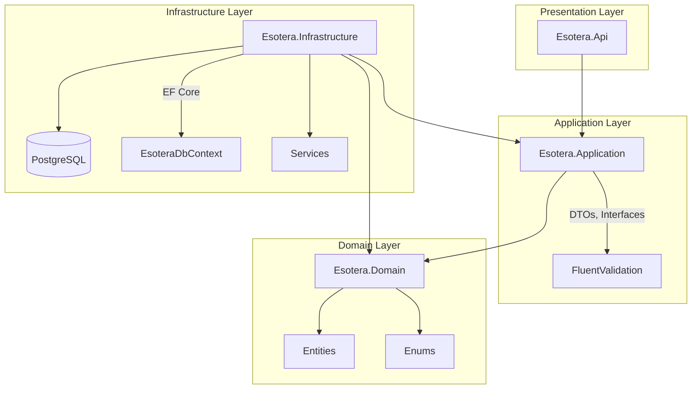

# Esotera Backend API

Backend ASP.NET Core 9 para a loja esotérica Esotera.

## Arquitetura



## Pré-requisitos

- .NET 9 SDK
- Docker (para PostgreSQL)
- Node.js (para o frontend)

## Como executar

### 1. Iniciar o PostgreSQL

```bash
cd backend
docker compose up -d
```

Isso iniciará o PostgreSQL na porta 5432 com:
- Database: `esotera`
- Username: `esotera`
- Password: `esotera_dev_only`

### 2. Aplicar Migrations

```bash
cd backend
dotnet ef database update --project Esotera.Infrastructure --startup-project Esotera.Api
```

### 3. Executar a API

```bash
cd backend/Esotera.Api
dotnet run
```

A API estará disponível em `https://localhost:5001` (ou a porta configurada).

## Swagger

Em desenvolvimento, acesse o Swagger UI em:
```
https://localhost:5001/swagger
```

## Autenticação

A API usa JWT para autenticação. Para obter um token:

```bash
# Registrar novo usuário
curl -X POST https://localhost:5001/api/auth/register \
  -H "Content-Type: application/json" \
  -d '{"name":"João","email":"joao@test.com","password":"senha123"}'

# Login
curl -X POST https://localhost:5001/api/auth/login \
  -H "Content-Type: application/json" \
  -d '{"email":"joao@test.com","password":"senha123"}'
```

### Usuários de Demonstração

Em ambiente de desenvolvimento, os seguintes usuários são criados automaticamente:

| Email | Senha | Role |
|-------|-------|------|
| admin@esotera.demo | demo123 | Admin |
| cliente@esotera.demo | demo123 | Customer |

## Testes

```bash
cd backend
dotnet test
```

## Variáveis de Ambiente

Veja `.env.example` para todas as variáveis disponíveis:

| Variável | Descrição | Padrão |
|----------|-----------|--------|
| `ConnectionStrings__Default` | Connection string do PostgreSQL | localhost |
| `Jwt__Key` | Chave secreta para tokens JWT | (veja appsettings) |
| `CORS_ALLOWED_ORIGINS` | Origens permitidas para CORS | http://localhost:3000 |
| `IMAGE_STORAGE_PATH` | Caminho para armazenamento de imagens | ../storage/products |
| `SEED_DEV_DATA` | Se deve popular dados de demonstração | true em Development |

## Estrutura de Pastas

```
backend/
├── Esotera.Api/           # Controllers, Middleware, Program.cs
├── Esotera.Application/   # DTOs, Interfaces, Validators
├── Esotera.Domain/        # Entities, Enums
├── Esotera.Infrastructure/# DbContext, Services, Migrations
├── Esotera.Tests/         # Testes de integração
├── storage/               # Armazenamento de imagens
│   └── products/
├── docker-compose.yml
└── Esotera.sln
```

## Endpoints Principais

### Auth
- `POST /api/auth/register` - Registrar usuário
- `POST /api/auth/login` - Login
- `GET /api/auth/me` - Dados do usuário logado

### Products
- `GET /api/products` - Listar produtos disponíveis
- `GET /api/products/{slug}` - Detalhes do produto

### Categories
- `GET /api/categories` - Listar categorias

### Orders
- `GET /api/orders` - Listar pedidos do usuário
- `POST /api/orders` - Criar pedido
- `GET /api/orders/{id}` - Detalhes do pedido

### Admin
- `GET /api/admin/products` - Listar todos os produtos
- `POST /api/admin/products` - Criar produto
- `PATCH /api/admin/orders/{id}/status` - Atualizar status do pedido

## Regras de Negócio

### Frete Grátis
- Subtotal (após desconto) >= R$ 99,90
- Estados: SP, RJ, MG, ES, PR, SC, RS

### Tabela de Frete
| Região | Econômico | Expresso |
|--------|-----------|----------|
| Sudeste | R$ 18,90 | R$ 29,90 |
| Sul | R$ 22,90 | R$ 34,90 |
| Outros | R$ 29,90 | R$ 44,90 |

J3: R$ 12,00 (configurável em StoreSettings)

### Cupom DESCONTO5
- Desconto: R$ 5,00
- Mínimo: R$ 50,00
- Uso único por cliente
- Não aplica no frete

## E-mail (recuperação de senha)

Configure no Render (sem versionar senhas):

- `EMAIL_ENABLED=true`
- `EMAIL_SMTP_HOST` (ex.: `smtp.gmail.com`)
- `EMAIL_SMTP_PORT=587`
- `EMAIL_SMTP_USE_SSL=true`
- `EMAIL_SMTP_USER`
- `EMAIL_SMTP_PASSWORD` (app password; nunca no repositório)
- `EMAIL_FROM_ADDRESS=esoteralivraria1@gmail.com`
- `EMAIL_FROM_NAME=Esotera`
- `FRONTEND_BASE_URL=https://esotera.vercel.app`

Sem SMTP configurado, a API ainda responde de forma genérica ao forgot-password, mas o e-mail **não** é entregue (NullEmailSender registra aviso).

## Mercado Pago

Ver `docs/MERCADO_PAGO.md` na raiz. Access Token apenas no backend (`MERCADO_PAGO_ACCESS_TOKEN`).

## TODO

- [ ] Webhook e criação de pagamento Mercado Pago
- [ ] Disparo de campanhas de newsletter
- [ ] Adicionar cache com Redis
- [ ] Implementar tracking de pedidos
